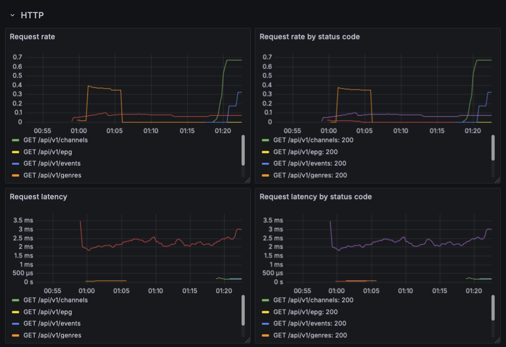

# Chanoodle: Observability

[Chanoodle](https://github.com/course-go/chanoodle) is an EPG, channel and event metadata service.
It exposes this data using REST API.

## Assignment

Chanoodle has a functioning REST API. However, we are unsure how it is performing
in production or what the actual traffic is, if any. Your goal in this assignment
will be to expose Prometheus metrics for the service and create visualizations
based on those metrics so they can be easily inspected and tracked over time.

### Specification

#### Metrics

First of all, you will need your service to instrument and expose
the Prometheus metrics. Create a new custom HTTP metrics middleware
that tracks information about HTTP request using the [built-in metric types](https://prometheus.io/docs/concepts/metric_types/).
To get and idea of what information about the requests you will need to track and
expose, view the [Visualizations](#visualizations).

Regarding the libraries, your will certainly need to import the
[Prometheus Client library](github.com/prometheus/client_golang).
Optionally, you can also use the [OpenTelemetry](go.opentelemetry.io/otel/)
and its interfaces.

> [!WARNING]
> In this case, do not use any predefined existing middleware like [Echo Prometheus Middleware](https://echo.labstack.com/docs/middleware/prometheus).
> The goal of this assignment is to primarily practice instrumenting these metrics manually.

#### Scraping the metrics

For our metrics backend, we will use Prometheus. If you already have an existing
Dockerfile or Docker compose for the service, you can reuse them. If not, you
will need to create one. Add [Prometheus](https://hub.docker.com/r/prom/prometheus)
to the compose as a dedicated service and configure it so it scrapes your application.

Prometheus exposes its own GUI dashboard (by default on port 9090) which you can
use to debug potential issues. You can view the scrape targets there, their
statuses and even query the metrics.

#### Visualizations

To visualize the metrics, you will need to add [Grafana](https://hub.docker.com/r/grafana/grafana)
to the compose, configure it and create a dashboard for the Chanoodle
service in which you will create the required graphs. After you are done with creating
the graphs, do not forget to export them using the JSON format and
save them to the project.

##### HTTP metrics

All the graphs depicted below should be based on your custom metrics
from the metrics middleware.

##### Health metrics

All the graphs depicted below should be based on the metrics exposed by the Go runtime.
These metrics are automatically exposed by the Prometheus handler.

## Requirements

The application is properly instrumented and a monitoring dashboard in Grafana
is set-up with the showcased graphs.

## Motivation

Monitoring is a necessity for real-life applications. Without them, debugging issues
in such applications is rendered basically impossible. This assignment practices
working with one of the most commonly used monitoring signal, metrics.
